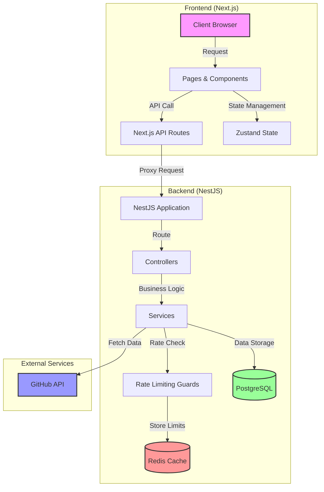

# GitHub Repository Explorer

## Overview

Build a full stack application that allows a user to search for GitHub repositories by entering a GitHub username. Your application will have:

**Backend**: An API that receives a username, calls GitHub’s public API, processes the results, and returns a simplified JSON response.

**Frontend**: A user interface where users can enter a GitHub username, submit the query, and view a list of the user’s repositories along with key details.

## Backend Requirements

## Tech Stack

Backend: NestJS, TypeScript, GitHub API, Redis (for caching), Docker
Frontend: Next.js, TypeScript, Zustand (for state management), SWR, Tailwind CSS, Docker

### API Endpoint

- Create a RESTful endpoint (e.g., GET /api/users/:username/repos).
- The endpoint should accept a GitHub username as a URL parameter.

### GitHub API Integration

- Use GitHub’s public API to fetch the list of public repositories for the given username.
- Extract and return the following details for each repository:
  - Repository Name
  - Description
  - URL (link to the repository)
  - Star Count
  - Fork Count
  - Primary Language

### Error Handling

- Gracefully handle cases such as:
  - Invalid or non-existent usernames.
  - Network or API errors.
  - Rate limiting issues.
- Return appropriate HTTP status codes and error messages.

### Optional Enhancement

- Implement a simple caching mechanism (e.g., in-memory cache) to store results for a short duration to avoid hitting GitHub’s API repeatedly for the same username.

## Frontend Requirements

- User Interface:
  - Develop a simple UI using a modern JavaScript framework/library.
  - Provide an input field where users can type a GitHub username.
- Interaction:
  - On form submission, call your backend endpoint to retrieve the repository data.
  - Display the results in a clear format (e.g., a list or table), showing at least:
    - Repository Name (as a clickable link to the GitHub page)
    - Description
    - Star Count
    - Fork Count
    - Primary Language
- Error Feedback:
  - Show a user-friendly error message when:
    - No repositories are found.
    - There is an error fetching data (e.g., invalid username, network issue).
- Styling:
  - Keep the design clean and simple.
  - Ensure the UI is responsive.

`Special attention should be paid to Rate Limiting. This means that the application should have mechanisms to handle errors related to exceeding the GitHub API request limits.`

## Additional Considerations

- Documentation:
Provide brief instructions on how to run your application (both backend and frontend). Include any assumptions or decisions you made during development.
- Code Quality:
Focus on writing clean, modular, and maintainable code. Comments and documentation are a plus.
- Testing (Optional):
If time permits, add simple unit tests for critical parts of your backend (e.g., testing the endpoint’s response to valid and invalid usernames).

## Getting Started

### Prerequisites

- Node.js 18+
- Docker
- Docker Compose
- Git

### Installation

```bash
# Clone repository
git clone https://github.com/username/rate-limiting.git

# Enter project directory  
cd rate-limiting

# Copy environment files
cp backend/.env.example backend/.env
cp frontend/.env.example frontend/.env

# Install dependencies
cd backend && npm install
cd ../frontend && npm install
cd ..

# Start development servers

## Option 1: Development with Docker (recommended)
# Start all services with hot-reload
docker compose -f docker-compose.dev.yml up -d

## Option 2: Development without Docker
# Terminal 1: Start backend (http://localhost:5111)
cd backend && npm run start:dev

# Terminal 2: Start frontend (http://localhost:3111)
cd frontend && npm run dev

# View logs
docker compose -f docker-compose.dev.yml logs -f

# Stop development servers
docker compose -f docker-compose.dev.yml down
```

### Development URLs

- Frontend: http://localhost:3111
- Backend: http://localhost:5111
- API Documentation: http://localhost:5111/api/docs

### Hot Reload

- Frontend changes will automatically trigger browser refresh
- Backend changes will automatically restart the NestJS server
- Database changes require manual migration: `npm run migration:run` in backend directory

## System Architecture Diagram


